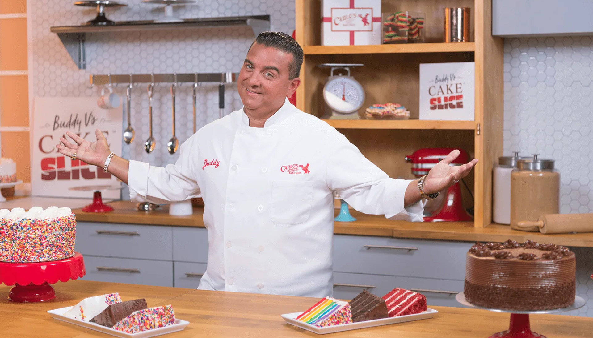
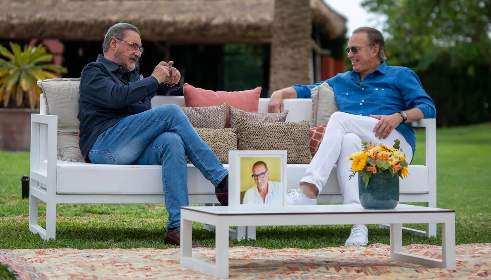
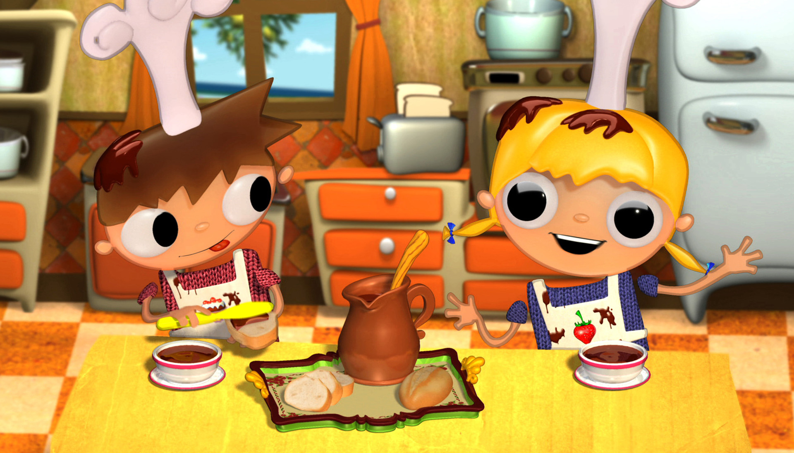
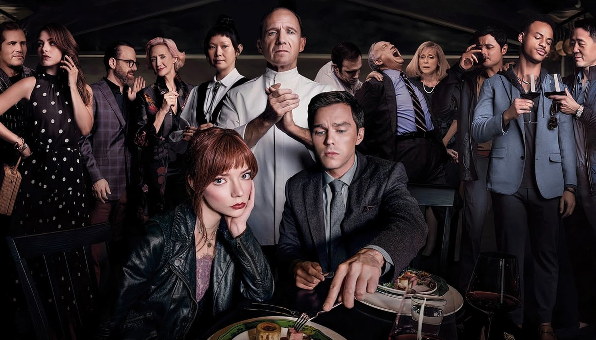

# PRACTICA_1_MWHE_4.2
 Marina Garrido y Sara González

<!-- MEDIDAS DE BOOSTRAP EN REM -->

m-0: 0rem
m-1: 0.25rem
m-2: 0.5rem
m-3: 1rem
m-4: 1.5rem
m-5: 3rem

<!-- DEJO AQUÍ PEGADO EL CARROUSEL ANTERIOR: -->

        

    <!-- CARRUSEL ARRIBA -->
    
 
    <!-- Carousel 1 -->
    

    

      

        

            <!-- 1 -->
            

            

                

                  
                  

                      

                        <h5>Cocina abierta de Karlos Arguiñano</h5>
                        
Disfruta de recetas sencillas y deliciosas en un ambiente cercano y divertido. Karlos Arguiñano te enseñará a preparar platos caseros y saludables, llenos de sabor, mientras comparte trucos y consejos útiles.

                      

                  

                

                

            

            <!-- 2 -->
            

            

                

                
                

                  

                    <h5>El Rey de las Tartas</h5>
                          
Acompaña a Buddy Valastro y su talentoso equipo en su famosa pastelería Carlos' Bakery, donde crean increíbles y elaborados pasteles para cualquier ocasión. Disfruta de la mezcla perfecta de arte y repostería, mientras Buddy comparte su pasión por la cocina.

                  

                

              

            

              
            

            <!-- 3 -->
            

            

              

                
                

                  

                    <h5>Ratatouille</h5>
                          
Esta película te lleva a París, donde un ratón llamado Remy sueña con convertirse en un gran chef. Acompáñalo en su aventura para superar obstáculos y seguir su pasión por la cocina, mientras forma una inesperada amistad con un joven cocinero.

                  

                

              

            

          

        

      

    

    

      

        

            <!-- 4 -->
            

            

              

                
                

                  
<h5>MasterChef</h5>
                    
Este programa reúne a aspirantes a chefs que compiten en desafiantes pruebas culinarias. Con la guía de chefs profesionales y críticos gastronómicos, los participantes demostrarán su creatividad y habilidades en la cocina mientras luchan por un lugar en la gran final.

                  

                

                

              

          

            <!-- 5 -->
            

            

              

                
                

                  

                    <h5>The Bear</h5>
                          
Esta serie sigue a un joven chef que regresa a Chicago para hacerse cargo del restaurante familiar después de la muerte de su hermano.   ¡No te pierdas esta emocionante experiencia culinaria!

                  

                

                

              

            

            <!-- 6 -->
            

            

              

                
                

                  

                    <h5>Crónicas carnívoras</h5>
                          
El chef y amante de la carne, Santiago de León, explora el fascinante mundo de la gastronomía carnívora. Desde parrillas hasta asados, cada episodio presenta recetas, técnicas y secretos para preparar los cortes más exquisitos. 

                  

                

              

              

            
 
            

        

    
     
    

    <!-- Controles del carrusel -->
    <button class="carousel-control-prev" type="button" data-bs-target="#carouselGuiaTV" data-bs-slide="prev">
    
    Previous
    </button>
    <button class="carousel-control-next" type="button" data-bs-target="#carouselGuiaTV" data-bs-slide="next">
    
    Next
    </button>
    

    <!-- CARRUSEL ABAJO -->
    
 
    <!-- Carousel 1 -->
    

    

    

      

          <!-- 1 -->
          

          

              

                
                

                    

                      <h5>Mi casa es la tuya</h5>
                      
Acercamos a los espectadores el lado más desconocido de personajes relevantes para la sociedad española; o bien acuden a casa del presentador o abren las puertas de su vivienda para tratar temas de gran interés.

                    

                

              

              

          

          <!-- 2 -->
          

          

              

              
              

                

                  <h5>Telmo y Tula: pequeños cocineros </h5>
                        
Telmo y Tula son unos simpáticos hermanos que enseñan a los niños a hacer manualidades y a cocinar recetas sencillas. Los hermanos siempre estarán acompañados por Paquito, un gracioso ratón que es su mascota.

                

              

            

          

            
          

          <!-- 3 -->
          

          

            

              
              

                

                  <h5>El Menú</h5>
                        
Margot y Tyler, una pareja joven, viajan a una isla remota para comer en un restaurante exclusivo donde un chef misterioso les prepara un menú costoso y opulento. Sin embargo, pronto queda claro que a los comensales les esperan algunas sorpresas.

                

              

            

          

        

      

    

    

    

    

      

          <!-- 4 -->
          

          

            

              
              

                
<h5>Lluvia de Albondigas</h5>
                  
Cuando la ciudad de Swallow Falls vive momentos difíciles, su población sólo puede comer sardinas. Flint Lockwood, un inventor fracasado, cree que él tiene la respuesta para la crisis de la ciudad.

                

              

              

            

        

          <!-- 5 -->
          

          

            

              
              

                

                  <h5>A fuego lento</h5>
                        
La cocinera Eugénie ha trabajado para el famoso gourmet Dodin durante los últimos 20 años. Cada vez más enamorados el uno del otro, su vínculo se convierte en un romance y da lugar a deliciosos platos que impresionan a los mejores chefs del mundo.

                

              

              

            

          

          <!-- 6 -->
          

          

            

              
              

                

                  <h5>Niquelao!</h5>
                        
La Terremoto de Alcorcón presenta la versión española de "Nailed it!", concurso en el que resposteros amateurs intentan replicar dulces de alta exigencia técnica.

                

              

            

            

          
 
          

      

    
     
    

    <!-- Controles del carrusel -->
    <button class="carousel-control-prev" type="button" data-bs-target="#carouselGuiaTV2" data-bs-slide="prev">
    
    Previous
    </button>
    <button class="carousel-control-next" type="button" data-bs-target="#carouselGuiaTV2" data-bs-slide="next">
    
    Next
    </button>
    

        

        
        <!-- BOTÓN -->
        

          <button type="button" class="btn btn-primary btn-tv">VER GUÍA TV</button>
        

<!-- EL CSS -->

#carouselGuiaTV .carousel-inner{
    display: flex;
}

#carouselGuiaTV2 .carousel-inner{
    display: flex;
}

#carouselGuiaTV .card {
    border: none;
    background-color: transparent;
    position: relative;
    overflow: hidden; 
    margin-bottom: 2em;
}

#carouselGuiaTV2 .card {
    border: none;
    background-color: transparent;
    position: relative;
    overflow: hidden; 
    margin-bottom: 2em;
}

#carouselGuiaTV img {
    border-radius: 35px;
    object-fit: cover;
    height:auto;
    width: 100%;
    max-height: 200px;
}

#carouselGuiaTV2 img {
    border-radius: 35px;
    object-fit: cover;
    height:auto;
    width: 100%;
    max-height: 200px;
}

.card {
    width: 100%;
    max-width: 18rem;
    margin-bottom: 2em;
}

.card-img-wrapper {
    position: relative;
}

.overlay {
    position: absolute;
    top: 0;
    left: 0;
    right: 0;
    bottom: 0;
    background-color: rgba(0, 0, 0, 0.705);
    display: flex;
    justify-content: center;
    align-items: center;
    opacity: 0;
    transition: opacity 0.3s ease;
    border-radius: 35px;
}

.text {
    color: white;
    text-align: center;
}

.text h5 {
    font-family: 'Helvetica Neue';
    font-weight: bold;
    margin-bottom: 0.5em;
    margin-left: 0.7em;
    margin-right: 0.7em;
    font-size: 1rem;
}

.text p {
    font-family: 'Helvetica Neue';
    font-weight:400;
    margin-bottom: 0;
    margin-left: 0.9em;
    margin-right: 0.9em;
    font-size: 0.8rem;
}

.card:hover .overlay {
    opacity: 1;
}

.btn-tv {
    background-color: var(--color-azul);
    border: none;
}